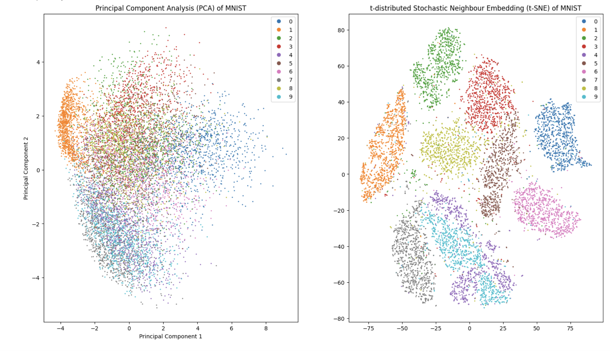
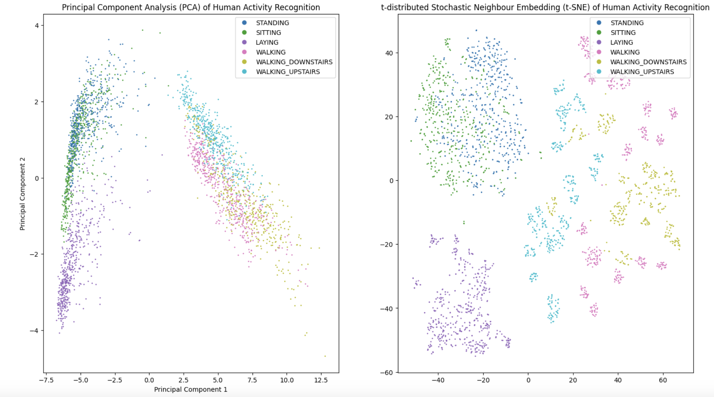
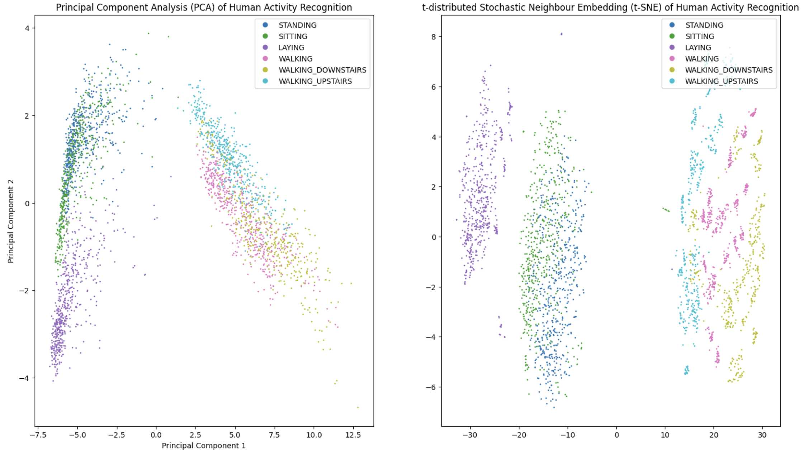
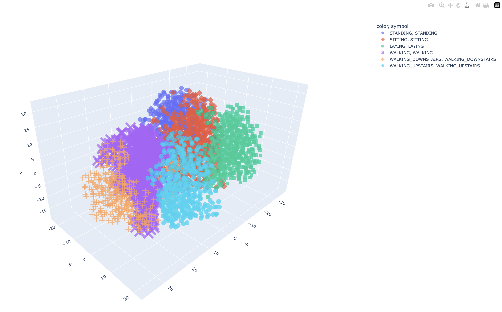

# PCA vs t-SNE: Visualising High-Dimensional Data

In this repository, we explore and compare two popular dimensionality reduction techniques: Principal Component Analysis (PCA) and t-Distributed Stochastic Neighbour Embedding (t-SNE). Both methods are powerful tools for visualising high-dimensional data in a lower-dimensional space, but they have distinct characteristics and use cases.

## Principal Component Analysis (PCA)
PCA is a linear dimensionality reduction technique that projects the data onto a new coordinate system, where the greatest variance by any projection of the data lie on the first coordinate (i.e. the first principal component), the second greatest variance on the second coordinate, and so on. PCA aims to reduce the dimensionality of the data while retaining as much variance as possible to explain the spread of the data.

### Key Characteristics of PCA

- Linear transformation: PCA performs a linear transformation of the original data.

- Variance maximisation: The principal components are chosen to maximize the variance in the data.

- Deterministic: PCA produces a unique solution, given the same input data.

- Computationally efficient: PCA is generally faster and less computationally intensive than t-SNE.

### The Math behind PCA

- The dataset is standardised such that it has a mean of 0 and a standard deviation of 1.

- The covariance matrix, which comprises the covariances associated with all pair combinations of the initial variables in the dataset, is computed (if there are 3 dimensions of data, the matrix will be 3 x 3). It is also symmetric with respect to the main diagonal, whose elements hold the variances of individual variables. Recall that the covariance between two variables are given by: 

```math

Cov(X,Y)=E[(X-E[X])(Y-E[Y])]=E[XY]-E[X]E[Y]

```
- Next, we identify the principal components by computing the eigenvectors $\textbf{v}$ and eigenvalues $\lambda$ of the covariance matrix $\textbf{A}$. Eigenvectors of the covariance matrix are the directions of the axes where there is the most variance (most information), and eigenvalues are simply the coefficients attached to eigenvectors (amount of variance carried in each principal component). To do this, we solve for the following equation:
```math

\mathbf{Av} = \lambda \mathbf{v}
```

- We then sort the eigenvectors based on their corresponding eigenvalues in descending order, and choose the top $k$ eigenvectors to form the new feature subspace.

- Lastly, we use the newly formed matrix $\mathbf{W}$ consisting of the eigenvectors to transform the data onto thne new subspace via the equation
```math
\mathbf{y} = \mathbf{W'x}
```
where $\mathbf{W'}$ is the transpose of the matrix $\mathbf{W}$.


## t-Distributed Stochastic Neighbor Embedding (t-SNE)

On the other hand, the t-SNE is a non-linear dimensionality reduction technique specifically designed for visualising high-dimensional data. t-SNE converts the similarities between data points into joint probabilities and minimises the Kullback-Leibler divergence between the joint probabilities of the low-dimensional embedding and the high-dimensional data.

### Key Characteristics of t-SNE

- Non-linear transformation: t-SNE performs a non-linear transformation, capturing complex relationships in the data.

- Local structure preservation: t-SNE focuses on preserving the local structure of the data, making it particularly effective for clustering and visualising similar data points.

- Stochastic: The results of t-SNE can vary between runs due to its stochastic nature.

- Computationally intensive: t-SNE is more computationally intensive and slower compared to PCA, especially for large datasets.


## Results

- In this simple respository, we show how t-SNE can be a good choice for visualising complex high-dimensional data over PCA.

- We start off with the MNIST dataset, for which PCA was unable to differentiate between the handwritten digits. t-SNE, on the other hand, was able to distinguish between the digits, albeit not as clearly for digits "9" and "4" (as expected, since they look so similar!).

<p align="center">

</p>

- Next, we attempt to visualise the more interesting Human Action Recognition (HAR) dataset, which contains embedded inertial sensor data (accelerometer and gyroscope) from a group of 30 volunteers engaging in six different activities, namely "walking", "walking upstairs", "walking downstairs", "sitting", "standing", and "laying". 

- Given the higher complexity of this dataset, both the PCA and t-SNE were unable to properly cluster the various categories, though the latter fared slightly better.

<p align="center">

</p>

- Increasing the perplexity of the t-SNE yielded slightly better results, but activities like "walking", "walking downstairs" and "walking upstairs" were still difficult to differentiate.

<p align="center">

</p>

- Since a 2D projection is unable to properly segmentise the clusters, perhaps a 3D projection would help? Indeed, having an additional degree of freedom greatly enhanced the t-SNE's capability in clustering the dataset:

<p align="center">

</p>

